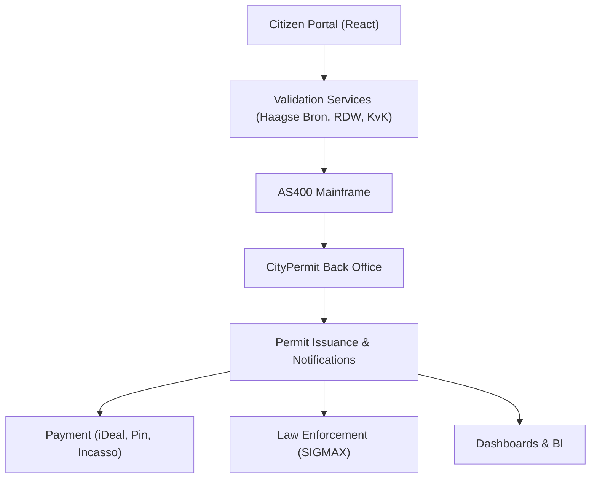

# 🚦 Digital Loket – Parking Permit System for Gemeente Den Haag

## 🧭 1. Project Overview

The Digital Loket – Parking Permit System is a flagship digital transformation for The Hague Municipality (Gemeente Den Haag), digitizing the end-to-end process for parking permit applications, renewals, and management.

- **Goals:**
  - Replace paper/manual workflows with a secure, accessible digital platform
  - Integrate legacy and modern systems for seamless citizen experience
  - Support public administration with automation and real-time insights
- **Scale:**
  - Over **185,000+ permits** digitized
- **Importance:**
  - Empowers citizens with self-service
  - Reduces municipal workload and error rates
  - Ensures compliance with Dutch government standards

## 🧱 2. System Architecture Diagram



## ⚙️ 3. Tech Stack

- **Frontend:** React, JavaScript, CSS Modules
- **Backend:** Legacy AS400, REST APIs, email/document intake
- **DevOps:** CI/CD pipelines (GitHub Actions, Azure DevOps), Git versioning, test automation
- **Security:** ISO 27001, BIG (Baseline Informatiebeveiliging Gemeenten), SSO (SAML), GDPR

## 👤 4. Role & Career Path

- **Frontend Developer (2018):**
  - Built UI flows for permit application, accessibility (WCAG), and localization
- **DevOps Engineer:**
  - Created CI/CD pipelines, automated deployments, and test coverage
- **Team Lead:**
  - Ensured staging-production integrity, code reviews, and release management
- **Scrum Master (2 squads):**
  - Implemented SAFe Agile, facilitated ceremonies, and cross-team planning

## 🧩 5. Key Technical Challenges (and Solutions)

### ✅ Challenge 1: Legacy AS400 Integration

**Problem:** AS400 lacks modern API interface

**Solution:** Built data transformers and adapters

```ts
// Example AS400 data adapter in Node.js
function normalizeAS400Data(raw) {
  return {
    licenseNumber: raw.VRGNR,
    citizenId: raw.BSN,
    permitStatus: raw.STATUS.trim().toLowerCase(),
  };
}
```

### ✅ Challenge 2: Manual document verification

**Solution:** Added smart validation on form level (React + Zod)

```tsx
const permitSchema = z.object({
  bsn: z.string().regex(/^\d{9}$/),
  address: z.string().min(5),
  vehicleOwner: z.boolean(),
});
```

### ✅ Challenge 3: CI/CD consistency

**Solution:** Introduced environment-aware deployment workflow

```yaml
name: Deploy to Production
on:
  push:
    branches: [main]
jobs:
  deploy:
    runs-on: ubuntu-latest
    steps:
      - uses: actions/checkout@v2
      - name: Setup Node
        uses: actions/setup-node@v2
        with:
          node-version: 18
      - name: Build & Deploy
        run: npm run deploy:prod
```

### ✅ Challenge 4: FTE-based business rule in Excel

**Problem:** Manual Excel calculation to decide permits per company

**Solution:** Built logic into a rule engine API

```ts
function calculateEligiblePermits(fte: number): number {
  if (fte <= 5) return 1;
  if (fte <= 15) return 2;
  return Math.floor(fte / 10);
}
```

## 🧬 6. Project Structure

```txt
/src
├── /frontend
│   ├── /components
│   ├── /pages
│   └── /forms
├── /backend
│   ├── /api
│   └── /as400-adapter
├── /devops
│   ├── /pipelines
│   └── /infrastructure
└── /docs
    └── architecture.md
```

## 📈 7. Measurable Impact

- **Permit processing time:** Reduced from ~5 days to < 24 hours for standard cases
- **Manual re-checking:** Cut by 60%
- **Deployment errors:** Zero in last 6 months (CI/CD automation)
- **Citizen NPS:** Improved by ~20% after UI redesign

## 🧠 8. Lessons Learned

- Working with legacy systems requires empathy and incrementalism
- Cross-functional team alignment (infra, frontend, policy) is key
- SAFe helps if you’re scaling agile in bureaucratic environments
